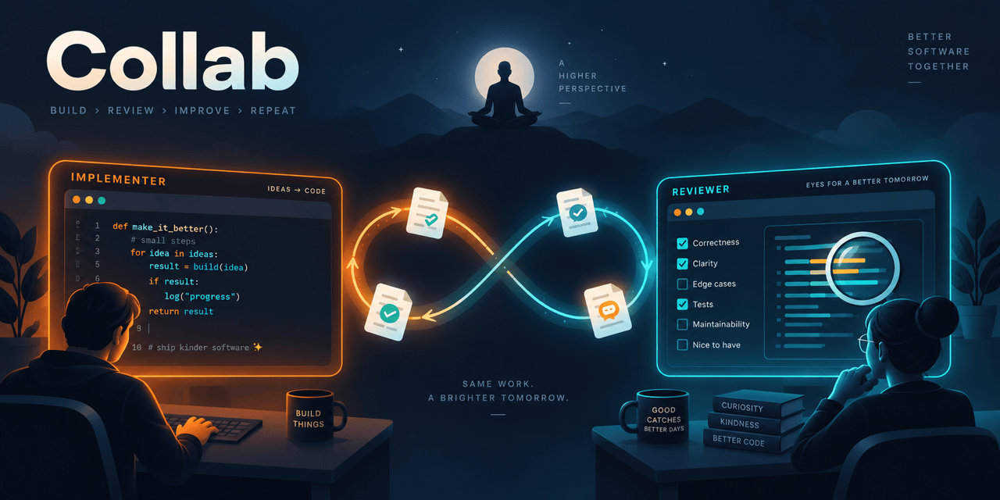

<p align="center">
  
</p>

<h1 align="center">Collab</h1>

<p align="center">
  <b>Let two AI coding agents pair-program with each other, one building and one reviewing, while you watch.</b><br>
  No more copy-pasting summaries and reviews between terminals.
</p>

<p align="center">
  <a href="https://github.com/Hokken/collab-skill/actions/workflows/test.yml"></a>
  = 18">
  
  <a href="LICENSE"></a>
</p>

---

## Why

If you use two coding agents, say **Claude Code** and **Codex CLI**, you've probably found that
one writes better code when the other reviews it. The workflow is great. The plumbing is not:

1. Ask the implementer for a summary of what it did.
2. Copy it into the reviewer's terminal.
3. Copy the review back.
4. Repeat until they agree.

**Collab automates the plumbing.** You give the task to one agent, start the other as the
reviewer, and they hand the work back and forth by themselves until the reviewer approves it.
You get a notification when it's done, or when they need you.

## How it feels

```text
You ▸ /Collab implement            (in Claude Code)
     "Add input validation to the signup form, with tests."

You ▸ $Collab review               (in Codex, another terminal)

  #000  implementer  brief     Add input validation to the signup form…
  #001  implementer  ready     Added zod schema, 9 tests, all passing
  #002  reviewer     changes   1. [blocking] email regex accepts "a@b" …
  #003  implementer  ready     Fixed 1: switched to zod .email(), +2 tests
  #004  reviewer     approve   Verdict: approved ✔

  🔔 collab: DONE
```

The agents took four turns and nobody copy-pasted anything. Each step, in full, stays browsable
in the dashboard and in the log.

## Features

- **Autonomous loop.** Implement → review → fix → review, task after task, until your whole
  request is done. It only stops for a real fault, a blocker, or when you say so.
- **Asks, doesn't stall.** When a choice is yours to make, you get a short list of options. Pick
  one and the pair carries on. The final report lists every decision made along the way.
- **Live dashboard.** `collab watch` shows whose turn it is, what they're doing right now, and
  every step so far. Browse them with the arrow keys.
- **Steer while it runs.** `collab note "don't touch the i18n files"` reaches the agents at their
  next step, and they must address it.
- **Queue up work.** Line up several tasks and the pair works through them one after another.
  Each task can carry its own options: tests that must pass, a scope, a branch, a commit when done.
- **Plan first (optional).** With `--plan`, the reviewer approves the approach before any code is
  written.
- **Reviews the real changes.** Each task snapshots your git repos (even several nested ones),
  so the reviewer sees exactly what changed, not just the implementer's summary.
- **Never gets stuck silently.** Agents post short progress updates. If one goes quiet, the other
  asks you: *stop, or keep waiting?*
- **Cheap to run.** Waiting is a blocking shell command, so no tokens are spent while an agent waits.
- **Tiny.** One Node.js file, no dependencies, works on macOS, Linux and Windows.

## Requirements

- **Node.js 18+**, and **git** (for reviewing diffs).
- Two agents that can load [agent skills](https://docs.claude.com/en/docs/claude-code/skills) and
  run shell commands. Tested with **Claude Code** and **Codex CLI**, in either role.

## Install

**macOS / Linux**

```bash
git clone https://github.com/Hokken/collab-skill.git
cd collab-skill
./install.sh
```

**Windows** (PowerShell)

```powershell
git clone https://github.com/Hokken/collab-skill.git
cd collab-skill
powershell -ExecutionPolicy Bypass -File .\install.ps1
```

**Or with the [skills](https://skills.sh) installer:**

```bash
npx skills add Hokken/collab-skill -g --agent claude-code codex
~/.agents/skills/collab/install.sh      # puts the `collab` command on your PATH
```

On Windows, run `~\.agents\skills\collab\install.ps1` for the second step. Update later with
`npx skills update`.

The git installer links the skill into `~/.agents/skills/Collab` (Codex) and
`~/.claude/skills/Collab` (Claude Code), and puts a `collab` command on your PATH. It only creates
links, so **updating is just `git pull`**. Windows users: see [docs/windows.md](docs/windows.md)
for a few tips.

Check it worked:

```bash
collab help
```

## Quick start

After [installing Collab](#install), follow these steps. This example uses Codex as the reviewer
and Claude Code as the implementer.

1. **Open three terminals in the same project folder.** Use the project you want the agents to
   work on, such as your app's repository.

2. **Start the reviewer in terminal 1.** Launch Codex CLI, then send this message in its chat:

   ```text
   $Collab review
   ```

   The reviewer will wait for the implementer to create a task. Leave it running.

3. **Give the implementer a task in terminal 2.** Launch Claude Code, then send this message in
   its chat, replacing the example task with your own:

   ```text
   /Collab implement Add input validation to the signup form, with tests.
   ```

   You don't have to include the task in the initial command. You can send `/Collab implement`
   on its own, wait for the agent to ask what to build, then describe your task in your next
   message. (If you already have queued tasks, it starts the first one instead.)

   The implementer writes a short brief and starts working. The two agents then take turns
   implementing, reviewing, and fixing the changes automatically.

4. **Watch progress in terminal 3.** Run this command at the shell prompt:

   ```bash
   collab watch
   ```

   Use ↑↓ to browse steps, ←→ for earlier tasks, and `q` to leave the dashboard. When the task
   finishes or needs your input, Collab notifies you and the agents report back.

You can swap the roles: use `/Collab review` in Claude Code and `$Collab implement` followed by
your task in Codex.

> 💡 Let the agents run without permission prompts (e.g. Claude Code's auto mode, or allow
> `Bash(collab:*)`), otherwise every handoff stops to ask you.

Want the approach agreed first? Add `--plan` before your task in step 3, for example:
`/Collab implement --plan Add input validation to the signup form, with tests.`

## Queue up a morning's work

```bash
collab queue add --branch feat/validation --check "npm test" --commit "Add signup form validation"
collab queue add --plan --focus security --scope "src/auth/**" --check "npm test" "Refactor the auth middleware"
collab queue add --confirm "Run the DB migration for user roles"
```

Then start the pair as usual, with `/Collab implement` and no task. The implementer takes the first
queued task. When it's done, it moves on to the next one, and the reviewer follows. If a task gets
escalated, the queue pauses until you've had a look. You can add tasks any time, even while they
work.

| Option | What it does |
|---|---|
| `--plan` | The reviewer approves a plan before any code is written |
| `--check "npm test"` | Must pass before every handoff. Collab runs it and refuses to hand off on failure |
| `--scope "src/auth/**"` | Files the task may change. `collab diff` flags anything outside, and the reviewer treats it as blocking |
| `--focus "security"` | What the reviewer should look at hardest |
| `--branch feat/x` | Work on this branch |
| `--commit` | Commit the changes when the task is done (never pushes) |
| `--confirm` | Ask you before this queued task starts |
| `--max-rounds N` | Review rounds before you are asked: more rounds, approve, or stop (default 4) |
| `--first` | Put it at the front of the queue |

The same options work for a single task: `/Collab implement --check "npm test" fix the login redirect`.
Manage the queue with `collab queue` (list), `collab queue rm 2`, `collab queue move 3 1` and
`collab queue clear`.

You don't have to split big jobs yourself. If a task is too big to review well in one go, the
implementer can split it with `collab queue split`. The current task becomes part 1, and the other
parts are queued right after it, with the same options. It tells you how it split the work, and
you can still edit the queue.

## While it runs

```bash
collab watch                                  # interactive dashboard (↑↓ steps · ←→ tasks · space scroll · q quit)
collab note "keep the public API unchanged"   # tell both agents something new
collab note -r "be strict on accessibility"   # just the reviewer (-i = just the implementer)
collab status                                 # one-line summary
collab log                                    # the full conversation between the agents
collab diff --stat                            # what actually changed in your code
collab abort                                  # stop both agents
```

When it's finished, both agents give you a short report. `collab clean` tidies up old tasks.

## Command reference

The same list as `collab help`, grouped by what you'd use it for. 🤖 marks commands the agents
also run themselves.

**Watch and steer**

| Command | What it does |
|---|---|
| `collab watch [--interval S]` | Interactive dashboard: steps (↑↓), tasks (←→), live progress |
| `collab note "text" [-i \| -r]` | Tell the agents something new (both by default; `-i` just the implementer, `-r` just the reviewer) |
| `collab snooze [MIN]` | Keep waiting on a slow agent: no idle prompt for MIN minutes (default 30). 🤖 when you answer *keep waiting* |
| `collab abort` | Stop the current task; both agents exit their loop. 🤖 when you answer *stop* |
| `collab answer <N \| text>` | Answer a pending decision: option N, or your own words. 🤖 when you pick an option in Claude Code |

**Look at a task**

| Command | What it does |
|---|---|
| `collab status` | One-shot summary of the current task. 🤖 after an unexpected exit code |
| `collab log` | Full history: brief, summaries, reviews, notes |
| `collab show [N]` | Print entry #N (default: the latest one) |
| `collab diff [--stat]` | What changed in the project since the task started. 🤖 the reviewer, on every review |
| `collab list` | All tasks (`*` = current) with status and round |
| `collab path` | Folder holding the current task's files |

**Queue and housekeeping**

| Command | What it does |
|---|---|
| `collab queue` | List queued tasks (`*` = this project) |
| `collab queue add [options] "task"` | Queue a task; the implementer starts it after the current one (options [above](#queue-up-a-mornings-work)) |
| `collab queue rm N` · `move N M` · `clear [--all]` | Edit the queue |
| `collab clean [--older-than D] [-n] [-y]` | Delete finished tasks and drafts older than a day (asks first; `-n` dry run, `-y` no prompt) |
| `collab help` | Print this list |

Add `-t <task-id>` to any command to target a task other than the current one.

<details>
<summary><b>Commands the agents run</b> (the skill handles these, you normally don't need them)</summary>

| Command | What it does |
|---|---|
| `collab init <slug> [options] [--from-queue [--confirmed "answer"]]` | Start a task (brief on stdin or `--file`) |
| `collab queue next` · `queue skip` | Show / drop the next queued task for this project |
| `collab queue split [--reason TEXT]` | Implementer: split the current task (parts on stdin, separated by `=== part ===` lines); part 1 stays, the rest queue next |
| `collab check` | Run the task's `--check` command |
| `collab scratch` | Folder for message drafts, notes and logs: the task's own, or a shared drafts folder before `init`. Keeps them out of your project |
| `collab join [--after ID]` | Reviewer: wait until a task exists, print its brief. With `--after` (the task it just finished), it also stops when the run ends |
| `collab end` | Implementer: the whole request is done. Ends the run for both agents (final report on stdin or `--file`) |
| `collab wait <implementer\|reviewer>` | Block until it's that agent's turn (or the task ends) |
| `collab progress "text"` | Post what you're doing now (shown to the other side) |
| `collab submit implementer <plan\|ready\|decide\|escalate>` | Hand off the turn (message on stdin or `--file PATH`) |
| `collab submit reviewer <changes\|approve\|decide\|escalate>` | Hand off the turn. `decide` asks you to pick a numbered option (`--self`: the asking agent shows the choice itself) |

Exit codes: `0` ok · `10` finished · `11` wait timed out · `12` new note · `13` other agent idle ·
`14` check failed · `15` queue empty · `16` decision for you · `1` error. See [docs/how-it-works.md](docs/how-it-works.md).

</details>

## FAQ

**Which models do they use?**
Whatever each CLI is set to. Collab never changes models. A strong reviewer with high reasoning
effort is usually worth it: reviews are short and missed bugs are expensive.

**Does it cost a lot of tokens?**
Not for the coordination. Waiting is a plain shell command, so an agent spends nothing while the
other works. You pay for the actual implementing and reviewing, as you would by hand.

**What if they disagree forever?**
They can't. After a round limit (default 4, `--max-rounds N`) you pick: 2 more rounds, approve
as it is, or stop the task. Before that, they settle technical calls themselves (the safest
option, noted in the final report). When a choice is really yours, such as product behaviour or
an ambiguous requirement, they ask you right away with a short list of options and carry on once
you pick one.

**What if an agent crashes or hangs?**
If the working agent goes quiet (no handoff, no progress update, no file changes for a while), the
waiting agent asks you whether to stop or keep waiting. `collab abort` always stops both.

**Can I still talk to the agents directly?**
Yes. Typing into either CLI works for quick, agent-specific tweaks. Use `collab note` for anything
both agents need to know, such as new requirements or scope changes, so the reviewer doesn't flag
your instructions as scope creep.

**Does it commit or push for me?**
Only if you ask: with `--commit`, the implementer commits a task's changes once it's approved. Collab
never pushes. Otherwise the agents follow your usual rules (`CLAUDE.md`, `AGENTS.md`).

**Can I run two pairs at once?**
Yes. Each agent pins its own task id, so pairs in different projects don't interfere.

## Configuration

All optional, via environment variables:

| Variable | Default | What it does |
|---|---|---|
| `COLLAB_MAX_ROUNDS` | `4` | Review rounds before you are asked how to go on |
| `COLLAB_IDLE_SECS` | `1800` | Quiet time before "stop or keep waiting?" |
| `COLLAB_QUIET_MINS` | `10` | …and no file changes for this long (implementer's turn) |
| `COLLAB_STALL_SECS` | `7200` | Hard stop when nobody answers |
| `COLLAB_POLL_SECS` | `5` | How often a waiting agent checks for its turn |
| `COLLAB_CHECK_TIMEOUT` | `1800` | Seconds before a `--check` command is stopped |
| `COLLAB_NOTIFY` | `1` | `0` turns off desktop notifications |
| `COLLAB_HOME` | `~/.collab` | Where task state is kept |

## How it works

Each agent runs the same skill ([`SKILL.md`](SKILL.md)), and the two coordinate through a small
state folder that the `collab` CLI manages. When it's not their turn, they block on
`collab wait`. When it is, they work, post progress, and hand off with `collab submit`.

Want the details, or to adapt it to other agents? See [docs/how-it-works.md](docs/how-it-works.md).

## Contributing

Issues and pull requests are welcome. The whole tool is [`bin/collab.js`](bin/collab.js) plus
[`SKILL.md`](SKILL.md).

```bash
npm test      # ~30 s, no dependencies to install
```

Please keep it dependency-free and cross-platform. CI runs the tests on macOS, Linux and Windows.

## License

[MIT](LICENSE)
